<h1 align="center">
  <br>
   
  <br>
</h1>
<p align="center">
<a href="https://www.npmjs.com/package/array-mixer"></a>
<a href="https://opensource.org/licenses/MIT"></a>
<a href="https://www.typescriptlang.org/"></a>
</p>

<p align="center">
  <strong>ArrayMixer</strong> is a tiny TypeScript-friendly utility (&lt; 1&nbsp;kB gzipped) for interleaving any number of arrays in a fully customizable order.<br>
  Powerful, dependency-free, and easy to use.
</p>

## Table of contents

- [What's new in v1](#whats-new-in-v1)
- [Installation](#installation)
- [Playground](#playground)
- [Quick start](#quick-start)
- [API](#api)
  - [`arrayMixer(...entries, options?)`](#arraymixerentries-options)
  - [`MixEntry<T>`](#mixentryt)
  - [`MixerOptions`](#mixeroptions)
- [Examples](#examples)
- [TypeScript support](#typescript-support)
- [Contributing](#contributing)
- [License](#license)

## What's new in v1

The previous `ArrayMixer(aliases, sequence)` API based on a string mini-DSL (`["2C", "4M"]`) was replaced by a clean, type-safe tuple-based API:

```ts
// before (v0.x)
ArrayMixer({ P: photos, A: ads }, ["2P", "1A"]);

// after (v1.x)
arrayMixer([2, photos], [1, ads]);
```

Why the change:

- **No mini-DSL** — sequences are plain data, no string parsing.
- **No aliases** — the source array is right there in the entry.
- **Generic types** — the result type is inferred from the inputs.
- **Options object** — opt into `limit`, `shuffle`, and `fill` strategies.

## Installation

```bash
pnpm add array-mixer
```

```ts
import { arrayMixer } from "array-mixer";
```

CommonJS, ESM, and a UMD bundle are all shipped. For a `<script>` tag:

```html
<script src="https://unpkg.com/array-mixer/release/array-mixer.umd.js"></script>
<script>
  const mixed = ArrayMixer.arrayMixer([2, photos], [1, ads]);
</script>
```

## Playground

Try the tuple API with emoji cards in the [ArrayMixer Playground](./playground.html).

## Quick start

Given two arrays, `photos` (12 items) and `ads` (6 items):

```ts
photos.length === 12; // true
ads.length === 6;     // true
```

Interleave **2 photos** followed by **1 ad** until both arrays are consumed:

```ts
const mixed = arrayMixer([2, photos], [1, ads]);
```

`mixed` will contain:

<div>
  
  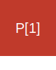
  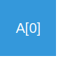
  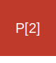
  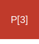
  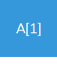
  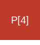
  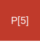
  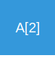
  
  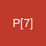
  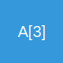
  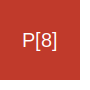
  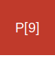
  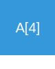
  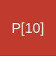
  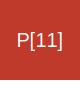
  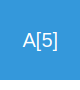
</div>

## API

### `arrayMixer(...entries, options?)`

Reorder one or more arrays into a single array by interleaving chunks of each.

```ts
function arrayMixer<T>(...entries: MixEntry<T>[]): T[];
function arrayMixer<T>(
  ...args: [...MixEntry<T>[], MixerOptions]
): T[];
```

The optional `options` object is detected automatically as the **last** argument when it is not a `MixEntry` tuple.

### `MixEntry<T>`

```ts
type MixEntry<T> = readonly [count: number, items: readonly T[]];
```

A tuple with two fields:

- `count` — how many items of this group to emit per round. Must be a positive integer.
- `items` — the source array.

### `MixerOptions`

```ts
interface MixerOptions {
  limit?: number;
  shuffle?: boolean;
  fill?: "repeat" | "skip" | "stop";
}
```

| Option    | Default     | Description |
|-----------|-------------|-------------|
| `limit`   | sum of input lengths | Forces a fixed result length. Useful for infinite feeds. |
| `shuffle` | `false`     | Shuffles each input array (Fisher–Yates) before mixing. Inputs are not mutated. |
| `fill`    | `"repeat"`  | What to do when an entry's source runs out: `"repeat"` cycles from the start, `"skip"` removes that group from further rounds, `"stop"` ends the result. |

Invalid runtime input throws clear errors:

- `count` must be a positive integer.
- `limit`, when provided, must be a non-negative integer.
- `fill`, when provided, must be `"repeat"`, `"skip"`, or `"stop"`.

## Examples

### 1) For every 7 photos display an ad

```ts
arrayMixer([7, photos], [1, ads]);
```

### 2) For every 4 paragraphs include 2 images

```ts
arrayMixer([4, paragraphs], [2, images]);
```

### 3) In a group of 8 related links, reserve positions 5–6 for sponsored

```ts
arrayMixer([4, related], [2, sponsored], [2, related]);
```

### 4) Display a list of songs with hits sprinkled in

```ts
arrayMixer([10, songs], [2, hits]);
```

### 5) Cycle puppies, kittens, and penguins in sequence

```ts
const mixed = arrayMixer([1, puppies], [1, kittens], [1, penguins]);
```

| `puppies`     | `kittens`     | `penguins`    | `mixed`                                  |
|---------------|---------------|---------------|------------------------------------------|
| [🐶, 🐶, 🐶] | [🐱, 🐱, 🐱] | [🐧, 🐧, 🐧] | [🐶, 🐱, 🐧, 🐶, 🐱, 🐧, 🐶, 🐱, 🐧] |

### 6) 1 large photo for every 2 medium followed by 3 small

```ts
arrayMixer([2, medium], [3, small], [1, large]);
```

<div>
  
  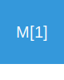
  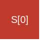
  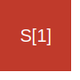
  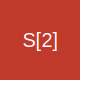
  
  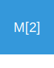
  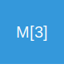
  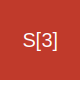
  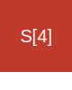
  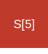
  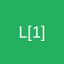
  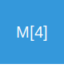
  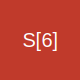
  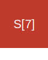
  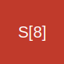
  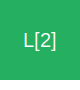
</div>

### 7) Cap an infinite feed with `limit`

```ts
arrayMixer([3, articles], [1, ads], { limit: 20 });
```

The result is exactly 20 items long; arrays cycle as needed (`fill: "repeat"` is the default).

### 8) Stop when any source runs out

```ts
arrayMixer(
  [2, [1, 2, 3, 4]],
  [1, [9]],
  { fill: "stop", limit: 100 },
);
// => [1, 2, 9, 3, 4]
```

### 9) Drop exhausted groups, keep the rest going

```ts
arrayMixer(
  [1, ["a", "b"]],
  [1, ["x", "y", "z", "w"]],
  { fill: "skip" },
);
// => ["a", "x", "b", "y", "z", "w"]
```

### 10) Shuffle each source before mixing

```ts
arrayMixer([2, ads], [5, articles], { shuffle: true });
```

## TypeScript support

The result type is inferred from the inputs:

```ts
const mixed = arrayMixer([2, ["red", "blue"]], [1, ["cat", "dog"]]);
// mixed: string[]

interface Photo { url: string }
const photos: Photo[] = [/* ... */];
const ads: Photo[] = [/* ... */];

const feed = arrayMixer([2, photos], [1, ads]);
// feed: Photo[]
```

## Contributing

You may contribute in many ways: new features, bug fixes, documentation improvements, or translations. See [CONTRIBUTING.md](CONTRIBUTING.md).

## License

[MIT](LICENSE) — Jota Teles

## Special thanks

- [Willian Ribeiro](https://github.com/willianribeiro)
- [João Paulo](https://github.com/jpusp)
