<h1 align="center">
  <br>
   
  <br>
</h1>
<p align="center">  
<a href="https://www.codacy.com/app/josetelesmaciel/array-mixer?utm_source=github.com&utm_medium=referral&utm_content=teles/array-mixer&utm_campaign=badger"></a>
<a href="https://www.codacy.com/app/josetelesmaciel/array-mixer?utm_source=github.com&utm_medium=referral&utm_content=teles/array-mixer&utm_campaign=Badge_Coverage"></a>
<a href="https://travis-ci.org/teles/array-mixer"></a>
<a href="https://www.npmjs.com/package/array-mixer"></a>
<a href="https://gitter.im/array-mixer/Lobby?utm_source=badge&utm_medium=badge&utm_campaign=pr-badge&utm_content=badge"></a>
 <a href="https://opensource.org/licenses/MIT"></a>
</p>

<p align="center">
  This repository contains the <strong>ArrayMixer</strong> source code.
  ArrayMixer is a tiny javascript lib with <strong>less than 1kb</strong> made to help ordering groups of arrays in a very personalized manner.
Powerful and easy to use.
</p>

## Table of contents

  * [Common usage](#common-usage)
  * [Installation](#installation)
     * [Node projects](#node-projects)
     * [Web projects](#web-projects)
  * [Parameters](#parameters)
     * [Aliases](#aliases)
     * [Sequence](#sequence)
  * [Examples](#examples)
     * [Example 1) For every 7 photos display an ad:](#example-1-for-every-7-photos-display-an-ad)
     * [Example 2) For every 4 paragraphs of text include 2 images:](#example-2-for-every-4-paragraphs-of-text-include-2-images)
     * [Example 3) In a group of 8 related links reserve positions 5 and 6 for sponsored links:](#example-3-in-a-group-of-8-related-links-reserve-positions-5-and-6-for-sponsored-links)
     * [Example 4) Display a list of songs including the most successful songs for every 10 songs:](#example-4-display-a-list-of-songs-including-the-most-successful-songs-for-every-10-songs)
     * [Example 5) You can also use larger aliases and the ES6 object shorthand:](#example-5-you-can-also-use-larger-aliases-and-the-es6-object-shorthand)
     * [Example 6) View photos of puppies, kittens and penguins in sequence:](#example-6-view-photos-of-puppies-kittens-and-penguins-in-sequence)
     * [Example 7) Include 1 large photo for every 2 medium size photos followed by 3 small photos:](#example-7-include-1-large-photo-for-every-2-medium-size-photos-followed-by-3-small-photos)
     * [More examples](#more-examples)
  * [Contributing](#contributing)
  * [License](#license)
  * [Special thanks](#special-thanks)

## Common usage

Let's think we have two arrays:  **photos** and **ads**.

```javascript
photos.length === 12; // true
ads.length === 6; // true
```

Use `ArrayMixer` to create a new array containing **2 photos** followed by **1 ad** until the end of both arrays.


```javascript
let mixedArray = ArrayMixer({P:photos, A:ads}, ["2P", "1A"]);
```

So `mixedArray` will contain:
<div style="display: flex;flex-wrap: wrap;">
  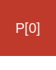
  
  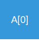
  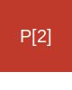
  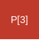
  
  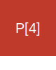
  
  
  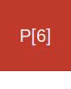
  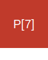
  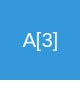
  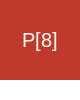
  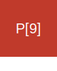
  
  
  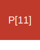
  
</div>

<h2 id="installation">Installation</h2>

`ArrayMixer` can be used in node projects and web projects.

### Node projects

Requires node version **5.7 or later**.

```bash
npm install array-mixer --save
```

Import it to your code using:

```javascript
const ArrayMixer = require("array-mixer");
```

### Web projects

[Download latest ES5 transpiled version from unpkg.com](https://unpkg.com/array-mixer@0.7.2/release/array-mixer.js).

Import *ES5* transpiled version to your code.

```html
<script src="https://unpkg.com/array-mixer@0.7.2/release/array-mixer.js"></script>
```

## Parameters


`ArrayMixer` has only two mandatory parameters.

```javascript
let aliases = {M:myArray, O:otherArray};
let sequence = ["3M", "5O"];

let mixed = ArrayMixer(aliases, sequence);
```


### Aliases

This parameter **should be** an object with keys used as alias for sequence and key values pointing to avaliable arrays.


### Sequence

This parameters uses the aliases defined on **aliases** parameter to create a sequence order to display the arrays.

## Examples

`ArrayMixer` can be used combining different arrays, aliases and sequences.
The following examples shows some ways to use it.

### Example 1) For every 7 photos display an ad:

```javascript
ArrayMixer({F: Photos, A: Ads}, ["7P", "1A"]);
```
**or** (as number 1 on sequence can be ommited):

```javascript
ArrayMixer({F: Photos, A: Ads}, ["7P", "A"]);
```

### Example 2) For every 4 paragraphs of text include 2 images:
```javascript
ArrayMixer({P: paragraphs, I: images}, ["4P", "2I"]);
```

### Example 3) In a group of 8 related links reserve positions 5 and 6 for sponsored links:
```javascript
ArrayMixer({R: related, S: sponsored}, ["4R", "2S", "2R"]);
```

### Example 4) Display a list of songs including the most successful songs for every 10 songs:
```javascript
ArrayMixer({M: musics, H: hits}, ["10M", "2H"]);
```

### Example 5) You can also use larger aliases and the ES6 object shorthand:
```javascript
ArrayMixer({days, weekend}, ["5days", "2weekend"]);
```

You can manipulate more than two vectors at a time, as in the following example:
 
### Example 6) View photos of puppies, kittens and penguins in sequence:

```javascript
let mixed = ArrayMixer({puppies, kittens, penguins}, ["puppies", "kittens", "penguins"));
```

| `puppies`               | `kittens`               | `penguins`                          | `mixed` |
|-----------------------|-----------------------|-----------------------------------|------------------------------------------------------------------------------|
| [🐶, 🐶, 🐶] | [🐱, 🐱, 🐱] | [🐧, 🐧, 🐧] | [🐶, 🐱, 🐧, 🐶, 🐱, 🐧, 🐶, 🐱, 🐧] |

### Example 7) Include 1 large photo for every 2 medium size photos followed by 3 small photos:

**Tip:** `ArrayMixer` lets you mix three or more arrays at once.

```javascript 
ArrayMixer({L:large, M:medium, S:small}, ["2M", "3S", "L"]);
```
<div style="display: flex;flex-wrap: wrap;">
  
  
  
  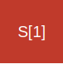
  
  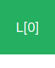
  
  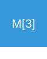
  
  
  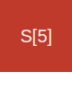
  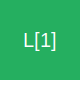
  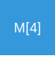
  
  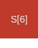
  
  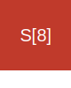
  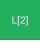
</div>

> **Disclaimer**: All arrays mentioned in this section must exist for the examples to work.

### More examples

For more example please check the [specification file](src/spec.js).

## Contributing

You may contribute in several ways like creating new features, fixing bugs, improving documentation and examples
or translating any document here to your language. [Find more information in CONTRIBUTING.md](CONTRIBUTING.md).

## License

[MIT](LICENSE) - Jota Teles - 2017

## Special thanks

* [Willian Ribeiro](https://github.com/willianribeiro);
* [João Paulo](https://github.com/jpusp);
